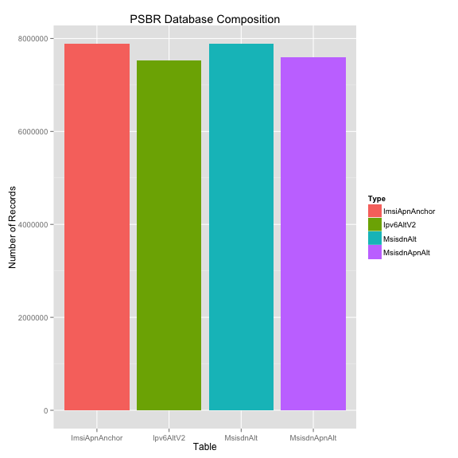

Performance Monitoring Using Ganglia
========================================================
author: Stephen Dimig
date: Mon Jul 13 20:36:03 2015
transition: rotate

Ganglia 
========================================================
Ganglia is a scalable distributed system monitor tool for high-performance computing systems such as clusters and grids.

- *Ganglia Monitoring Daemon (gmond)* Runs on the node being monitored. Gathers metric data through a extensible python script.
- *Ganglia Meta Daemon (gmetad)* Runs on the Ganglia server. Collects forwarded data and stores it in the RRD.
- *Ganglia PHP Web Front-end* Runs on the Ganglia server. Provides a view of the gathered information via real-time dynamic web pages.
- *RRD* Realtime database for storage of Ganglia metrics.
- *Ganglia* is distributed under BSD license

R-Studio
========================================================
RStudio is a free and open source integrated development environment (IDE) for R, a programming language for statistical computing and graphics.
- *R* is a programming language for statistical computing and graphics. 
- *Knitr*  is an engine for dynamic report generation with R. It is a package in R that enables integration of R code into reports (ie; you can include code and data in the same report template).
- *R Mardown* is a  lightweight markup language with plain text formatting syntax designed so that it can be converted to HTML.
- *RStudio* is distributed under the GNU General Public License

VE-DSR Performance Monitoring 
========================================================

PSBR
========================================================
The Ganglia Monitoring Daemon (gmond) runs on the PSBR. It periodically gathers metric data and forwards it to the Ganglia Web server through the NO which acts as a relay.

- *gmond.conf* is a configuration file in /etc/ganglia/gmod.conf. It contains information that gmond requires to run.
- *psbr.py* is a python script that is used to gather all of the psbr related metrics. The gmond daemon will periodically invoke this script. It contians definitions for all of the metrics including a function to invoke and it's type.
- *psbr.pyconf* this file contains the name of each metric defined in psbr.py above plus a title that will be displayed by the web interface.

NO
========================================================
The Ganglia Monitoring Daemon (gmond) runs on the PSBR but it acts only as a relay forwarding data from the PSBRs to the Ganglia server. All of our lab metrics currently go through the same NO.

- *gmond.conf* is a configuration file in /etc/ganglia/gmod.conf. It contains information that gmond requires to run.

Ganglia Web Server
========================================================
The Ganglia Web Server runs the Ganglia Meta Daemon (gmetad) and Ganglia PHP Web Front-end. We run this on an old G6 card in the lab. It has more extensive RPMs installed on it than a client.

- *rrd2csv.py* Ganglia stores metric data from the monitored nodes in an RRD database. RRD has a binary format and is laid out with one metric per file. The rrd2csv.py allows you to generate a csv file from the RRD data so you can do more detailed analysis on it.

Ganglia PSBR CPU Example
========================================================

Ganglia PSBR Session Recs Example
========================================================

Your PC
========================================================
You can do analysis on the CSV file for a performance run on your loacal PC using Excel or R-Studio. I prefer the second option because it easier. You can generate a report for a new run by just changing out the csv file and hitting a single button.

- *psbr.Rmd* the R-markdown file that is a template for a perfomance analysis report.
- *psbr.Rpres* you can also do interactive presentations of the report data using a charting package like googleVis or rCharts.

Dynamic Report Generation
========================================================
R-Studio offers dynamic report generation through knitr which is a package that enables integration of R code into reports (ie; you can include code and data in the same report template).

- *Knitr* allows R code and documentation to exist in the same file so that changing the data results in a whole new report.
- *R Mardown* is a  lightweight markup language with plain text formatting syntax designed so that it can be converted to HTML.
- *psbr.Rmd* Template of a perfomance analysis report for PSBR.

The following graphs are the type of thing you might see in a dynamic report using R-Studio. Note you can also do statistical analysis on the data. Dynamic reports are great for comparing runs with different configurations, etc.

Example Table
========================================================

| __Resource__  | __Value__  |
| ------------------------- | -------- |
| Start                    :| 07/02/2015 09:59:30 |
| End                      :| 07/02/2015 11:06:45 |
| Duration                 :| 1.12 Hours |
| RAM Start                :| 60.74 % |
| RAM End                  :| 60.75 % |
| RAM Minimum              :| 60.73 % |
| RAM Maximum              :| 61.04 % |
| RAM Average              :| 60.87 % |
| CPU Usage                :| 15.9 % |
| Number Bindings - Mean   :| 7889770.37|
| Ingress Stack Event Rate :| 8854.34 |
| Egress Stack Event Rate  :| 10859.51 |

Example CPU Analysis
========================================================

 

Example Database Composition
========================================================

 

Example ComAgent Stack Event Rates
========================================================

 

Dynamic Presentation Generation
========================================================
R-Studio offers dynamic presentation generation through the R-Presenation package that enables integration of R code into presentations (ie; you can include code and data in the same presentation template).

- *R Presentation* allows R code and documentation to exist in the same file so that changing the data results in a whole new presentation.
- *R Mardown* is a  lightweight markup language with plain text formatting syntax designed so that it can be converted to HTML.
- *R Mardown* is a  lightweight markup language with plain text formatting syntax designed so that it can be converted to HTML.
- *psbr.Rpres* Template of a dynamic presentation for PSBR.
- *Interactive Charts* R Presentaion has support for interactive charts through rCharts or GoogleVis.

Example googleVis chart
========================================================

<!-- LineChart generated in R 3.1.2 by googleVis 0.5.8 package -->
<!-- Mon Jul 13 20:36:07 2015 -->

<!-- jsHeader -->

 
<!-- jsChart -->  

 
<!-- divChart -->
  

Example googleVis bar chart
========================================================
<!-- BarChart generated in R 3.1.2 by googleVis 0.5.8 package -->
<!-- Mon Jul 13 20:36:07 2015 -->

<!-- jsHeader -->

 
<!-- jsChart -->  

 
<!-- divChart -->
  

Example googleVis pie chart
========================================================
<!-- PieChart generated in R 3.1.2 by googleVis 0.5.8 package -->
<!-- Mon Jul 13 20:36:07 2015 -->

<!-- jsHeader -->

 
<!-- jsChart -->  

 
<!-- divChart -->
  

Client Installation
========================================================

- You can find a gzip file with a client insallation at ~dimig/Public/ganglia.
- Scp the gzip file to the target machine
- Uncompress the archive: gunzip ganglia.rpms.tar.gz
- Untar the archive file: tar xvf ganglia.rpms.tar
- This will create an rpms driectory that will include all of the required ganglia rpms plus some important files.
- Run the install.sh script: install.sh
- This will install all of the rpms, copy the files to where they need to be, and retart the gmond and httpd servers.
- All metric data will be forwarded to the Ganglia server at http://100.64.149.71/ganglia. 
